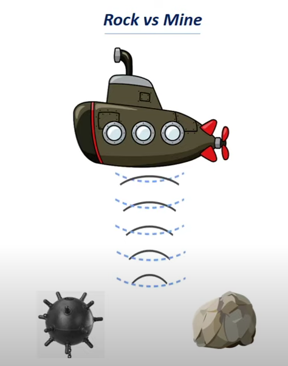
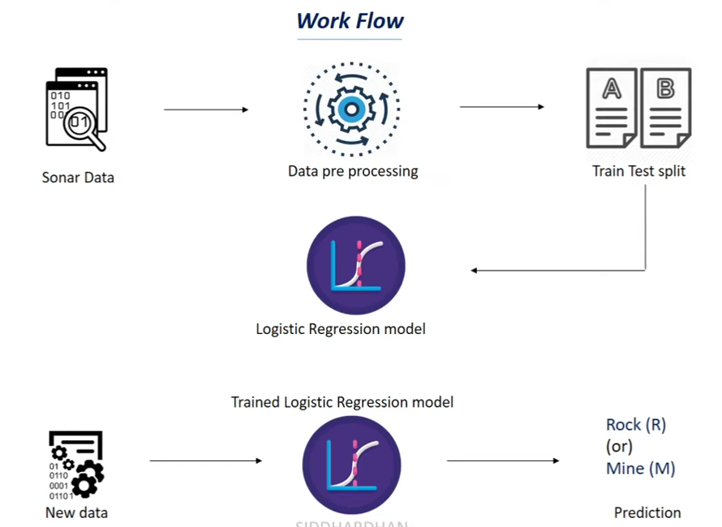

# Rock-Vs-Mine-Prediction-Using-ML
Rock Vs Mine Prediction is a machine learning project that classifies sonar signal data to distinguish between rocks and mines using a Logistic Regression model. This project utilizes the UCI Sonar dataset and is implemented in a Jupyter Notebook environment.

---

**📷Pictorial Generic Diagram**

**📊 Features**

**🧠 Binary Classification with ML**

Implemented a Logistic Regression classifier to identify objects as either Rock (R) or Mine (M) based on sonar frequency features.

**📂 Data Exploration and Preparation**

Loaded the Sonar dataset using pandas

Analyzed data shape, statistical summaries, and class distribution

Grouped data by label to observe feature trends between Rock and Mine signals

Split data into training and test sets using train_test_split

**🎯 Model Training and Evaluation**

Trained a Logistic Regression model without feature scaling

Achieved high accuracy on both training and test sets

Used accuracy_score from scikit-learn to evaluate model performance

**🏢 Workflow Diagram**

---

**🔍 Prediction on Custom Input**

Included a section to test predictions on new custom input values (60 features as required by the dataset)

---

**🧩 Data & Architecture**

Dataset: Sonar Dataset from UCI repository (60 numerical features, 1 categorical target)

Model: Logistic Regression (no preprocessing like scaling used)

Split: 90% training / 10% testing with stratified sampling

---

**🛠️ Technologies Used**

Python 3

Jupyter Notebook

Pandas & NumPy

Scikit-learn (LogisticRegression, train_test_split, accuracy_score)

Pickle (for optional model saving)

---

**🚀 How to Run**

Clone or download the repository

Place sonar_data.csv in the same directory as the notebook

Open the notebook with Jupyter or Google Colab

Run all cells to train the model and perform predictions

Modify the custom input section to test with different data

---

**📌 Project Goals**

Explore the Sonar dataset for binary object classification

Train a simple but effective ML model using raw features

Demonstrate the full pipeline from loading to prediction

Allow for future expansion using other models or preprocessing techniques

---

**📁 File Structure**

Copy
Edit
📁 Rock-Vs-Mine-ML/
 ┣ 📄 SONAR_Rock_VS_Mine_Prediction_Using_ML.ipynb
 ┗ 📄 sonar_data.csv

---
 
**🤝 Contributing**

You’re welcome to enhance the project by adding feature scaling, more advanced models (e.g., SVM, Random Forest), or a front-end interface using Streamlit.

---

**📬 Contact**

For questions or suggestions, feel free to open an issue or reach out on GitHub.

LinkedIn: [Sarvesh Chavan](https://linkedin.com/in/sarvesh-chavan)

---

**📝 Note:** This project uses raw input features for model training. No normalization or scaling has been applied, making it a great example of baseline model performance.

---

**TO DOWNLOAD THE PROJECT :-**

[SONAR_Rock_VS_Mine_Prediction_Using_ML.ipynb](https://drive.google.com/file/d/1sw0f0Iz2LqWCVOyGaAGAZ__tkE54W3q3/view?usp=sharing)
